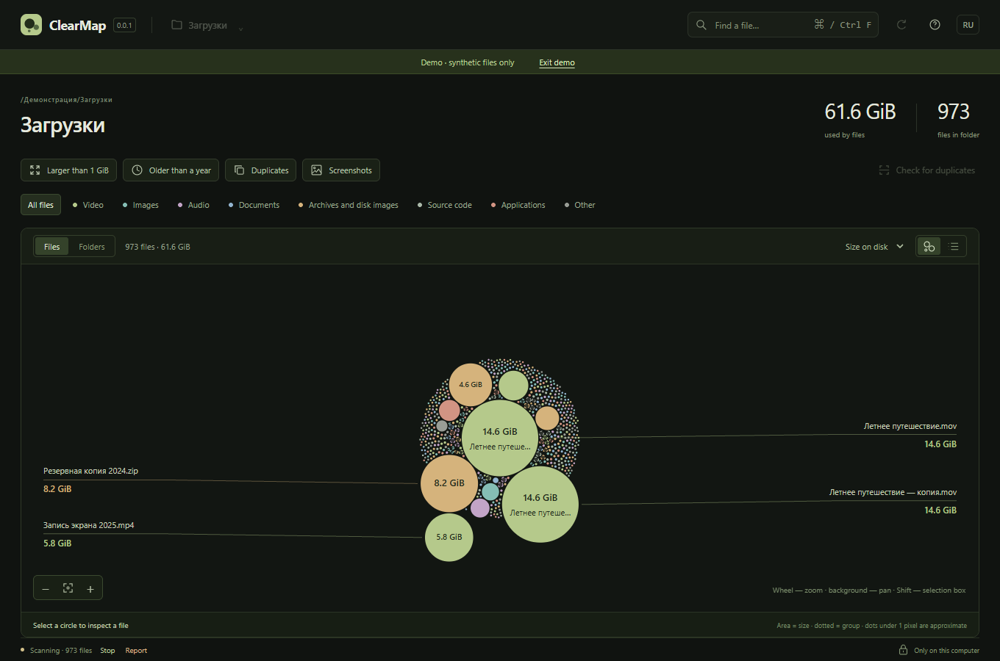
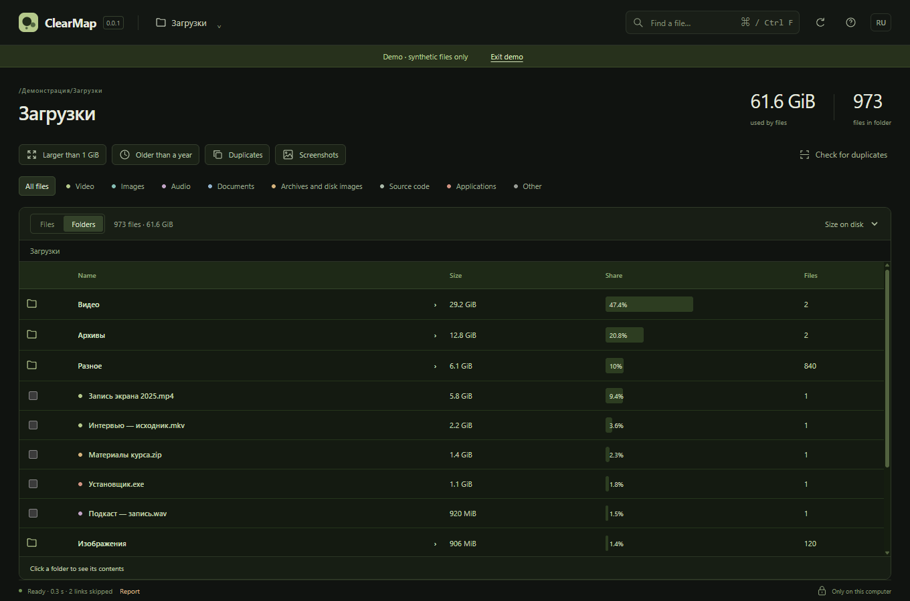

# ClearMap 0.0.2

[Русская версия](README.md)

ClearMap is a local file map for careful cleanup. It visualizes a selected folder and can move explicitly selected files to the operating system Trash after a second identity check.



## Features

- scan a selected folder with a map, search, filters, and an exact list;
- two modes: Files uses size-based circles without age rings; Folders lists immediate files and directories by descending size;
- recursive directory sizes, shares of the current folder, drill-down and navigation back through the path or Alt+↑;
- find duplicates using full BLAKE3 hashes after prechecks;
- open a file or reveal it in the system file manager;
- reviewable delete plans with revisions, identity checks, and Trash moves.

Archiving, compression, overwriting, directory deletion, and permanent deletion are not implemented. Moving an item to Trash does not promise freed disk space; the user empties Trash through the operating system.

In Folders, search and filters apply to nested files: sizes show matching files only. Without filters, empty directories are also visible. Selection and Ctrl+A apply only to files on the current page; folders open for browsing.



## Run

ClearMap is a Tauri desktop application, not a website or local server. It requires Node.js 22+, stable Rust, and Tauri system prerequisites. On Windows install Visual Studio Build Tools with Desktop development with C++ and WebView2; on macOS install Xcode Command Line Tools; on Linux install WebKitGTK 4.1, WebKit development packages, `libxdo`, OpenSSL, AppIndicator, and librsvg. From the repository root:

```sh
npm ci
npm run desktop
```

The app's language switch is persisted between launches.

## Verification

```sh
npm run typecheck
npm test
npx playwright install chromium
npm run test:e2e
cargo fmt --all -- --check
cargo clippy -p clearmap-core --all-targets --locked
cargo test -p clearmap-core --locked
npm run tauri -- build --no-bundle
```

Read [the architecture](docs/ARCHITECTURE.md), [the safety boundaries](docs/SAFETY.md), and [the verification report](docs/VERIFICATION.md) before using personal data. The report lists completed native checks and limits conclusions by platform.

File-operation tests use temporary directories and TestTrash. The project has no telemetry, automatic updates, or server upload of files, paths, or hashes.

## Release executables

Run the `Release executables` workflow manually from `main` with a version such as `0.0.2`. It builds one native executable per Windows, macOS, and Linux runner with `--no-bundle`, then publishes tag `vX.Y.Z` with the three files and `SHA256SUMS`. No installers or platform bundles are produced.

Licensed under MIT.
