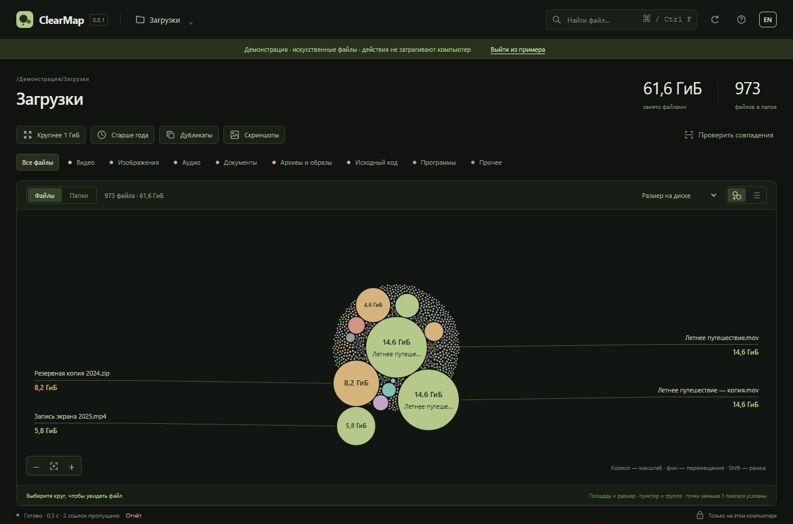
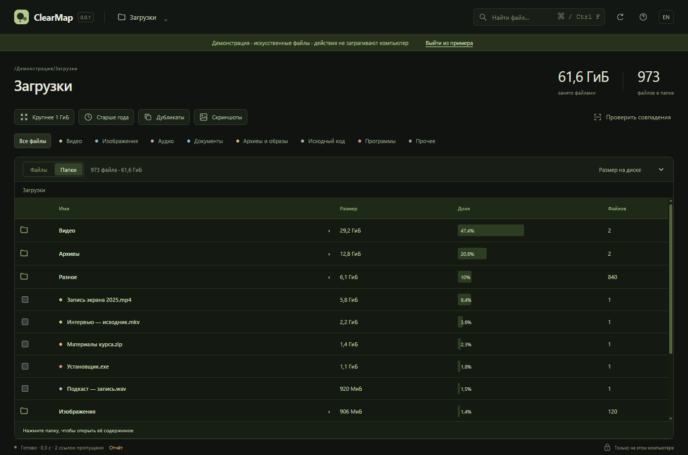

# ClearMap 0.0.2

[English version](README.en.md)

Локальная карта файлов для осторожной уборки папки. Крупные файлы видны на карте, а выбранные элементы можно после повторной проверки перенести в системную Корзину.



## Возможности

- сканирование выбранной папки и карта с поиском, фильтрами и точным списком;
- два режима: «Файлы» — круги по размеру без возрастных колец; «Папки» — каталоги и файлы текущего уровня по убыванию размера;
- суммарные размеры вложенных файлов, доля от текущей папки, переход внутрь и возврат по пути или Alt+↑;
- поиск дубликатов по полному BLAKE3 после предварительных проверок;
- открыть файл или показать его в системном файловом менеджере;
- план удаления с ревизией, проверкой идентичности и переносом в Корзину.

Архивирование, сжатие, перезапись, удаление каталогов и безвозвратное удаление не реализованы. Перенос в Корзину сам по себе не обещает освобождение места: Корзину очищает пользователь средствами ОС.

В режиме «Папки» поиск и фильтры применяются к вложенным файлам: размеры показывают только совпадения. Без фильтров видны и пустые каталоги. Выбор и Ctrl+A относятся только к файлам текущей страницы; папки открываются для просмотра.



## Запуск

ClearMap — настольное приложение на Tauri, а не сайт и не локальный сервер. Нужны Node.js 22+, стабильный Rust и системные зависимости Tauri. Для Windows установите Visual Studio Build Tools с Desktop development with C++ и WebView2; для macOS — Xcode Command Line Tools; для Linux — WebKitGTK 4.1, WebKit development packages, `libxdo`, OpenSSL, AppIndicator и librsvg. Из корня проекта:

```sh
npm ci
npm run desktop
```

Переключатель языка приложения сохраняется между запусками.

## Проверки

```sh
npm run typecheck
npm test
npx playwright install chromium
npm run test:e2e
cargo fmt --all -- --check
cargo clippy -p clearmap-core --all-targets --locked
cargo test -p clearmap-core --locked
npm run tauri -- build --no-bundle
```

Перед использованием на личных данных прочитайте [архитектуру](docs/ARCHITECTURE.md), [границы безопасности](docs/SAFETY.md) и [отчёт о проверках](docs/VERIFICATION.md). Отчёт перечисляет выполненные native-проверки и отдельно ограничивает выводы по платформам.

Тесты файловых операций используют временные каталоги и TestTrash. Проект не отправляет файлы, пути или хеши на сервер, не содержит телеметрии и автоматических обновлений.

## Сборка релиза

В GitHub Actions вручную запускается workflow `Release executables`. Он проверяет версию, собирает нативный исполняемый файл без Tauri bundle на Windows, macOS и Linux и публикует тег `vX.Y.Z` с тремя запускаемыми файлами и `SHA256SUMS`. Установщики, `.dmg`, `.deb`, `.AppImage` и другие пакеты не создаются. Подпись и нотариальное заверение не настроены.

Лицензия — MIT.
