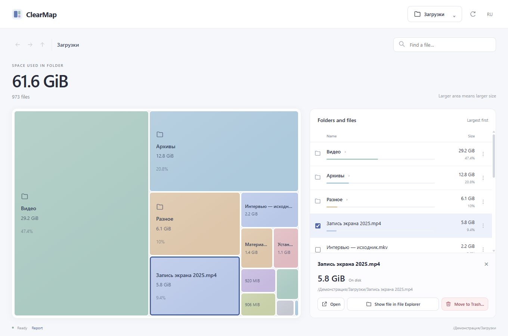

# ClearMap

**Узнайте, что занимает место.**

ClearMap — настольное приложение, которое превращает папку в наглядную карту размеров. Находите крупные файлы, просматривайте их папки и решайте, что оставить.

[English](README.md) · [Скачать](https://github.com/lumenikoly/Disklume/releases) · [Описание релиза](CHANGELOG.md)



*Превью снято на искусственных данных. Приложение работает с папками, которые вы выбираете на своём компьютере.*

## Просмотр занятого места

- **Находите крупное.** Площадь прямоугольника соответствует размеру на диске; папки включают вложенные файлы.
- **Переходите по папкам.** Нажмите папку на карте или в списке. Используйте кнопки «Назад», «Вперёд», «Выше» или путь сверху; история сохраняет поиск и позицию списка.
- **Ищите файлы.** Поиск по имени и пути работает внутри текущей папки.
- **Выбирайте действие.** Открыть файл, показать в Проводнике, Finder или файловом менеджере либо перенести выбранные файлы или целые папки в Корзину после проверки. Действия доступны через правый клик на карте и кнопку «⋮» в строке.
- **Выбирайте язык.** Доступны английский и русский; выбор сохраняется.

Карта и список показывают одну страницу, до 200 объектов. Блок «На других страницах» сохраняет пропорции относительно всей папки. При поиске размеры отражают совпадающие файлы. Пустые объекты доступны в списке.

## Скачать

Исполняемые файлы для Windows, macOS и Linux доступны в [GitHub Releases](https://github.com/lumenikoly/Disklume/releases); контрольные суммы находятся в `SHA256SUMS`. Для Windows нужен WebView2, для Linux — системные библиотеки Tauri.

ClearMap работает локально, без аккаунта, телеметрии и отправки файлов. Перенос в системную Корзину запускается только после подтверждения. Он не гарантирует освобождения места; размеры на диске — оценка. Охват платформ и проверок описан в [отчёте](docs/VERIFICATION.md), границы файловых операций — в [правилах безопасности](docs/SAFETY.md).

## Запуск из исходников

Нужны Node.js 22+, стабильный Rust и системные зависимости Tauri:

- Windows: Visual Studio Build Tools с **Desktop development with C++** и WebView2.
- macOS: Xcode Command Line Tools.
- Linux: WebKitGTK 4.1 development packages, `libxdo`, OpenSSL, AppIndicator и librsvg.

```sh
npm ci
npm run desktop
```

## Разработка

Запускайте проверки последовательно:

```sh
npm run typecheck
npm test
npx playwright install chromium
npm run test:e2e
cargo fmt --all -- --check
cargo clippy -p clearmap-core --all-targets --locked
cargo test -p clearmap-core --locked
npm run tauri -- build --no-bundle
```

Интерфейс на TypeScript обращается к ядру Rust через узкую границу Tauri. Файловые операции используют ID сессии и файла; проверка идентичности и подтверждённой ревизии плана остаётся в Rust. Файловые тесты используют временные каталоги и `TestTrash`. Подробнее — в [архитектуре](docs/ARCHITECTURE.md).

## Релиз 0.0.3

Workflow `Release executables` собирает исполняемые файлы Windows, macOS и Linux, рассчитывает SHA-256 и публикует описание из [CHANGELOG.md](CHANGELOG.md). Подготовка и публикация описаны в [инструкции](docs/RELEASE.md).

## Лицензия

[MIT](LICENSE).
